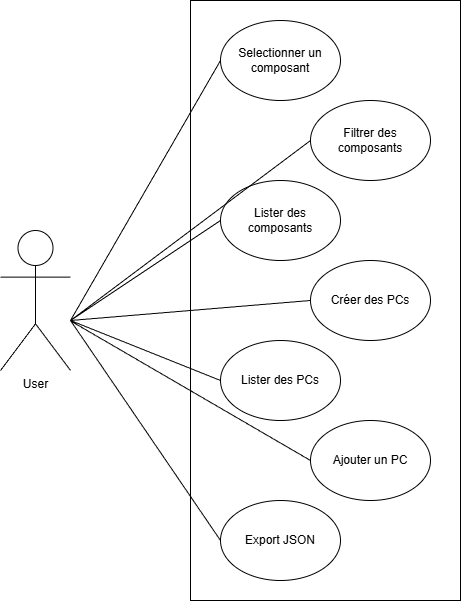
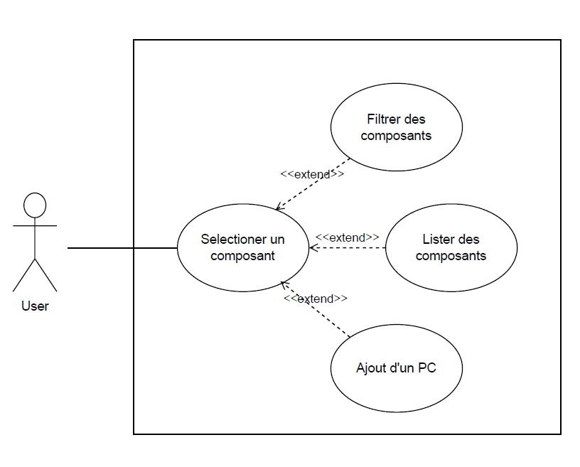
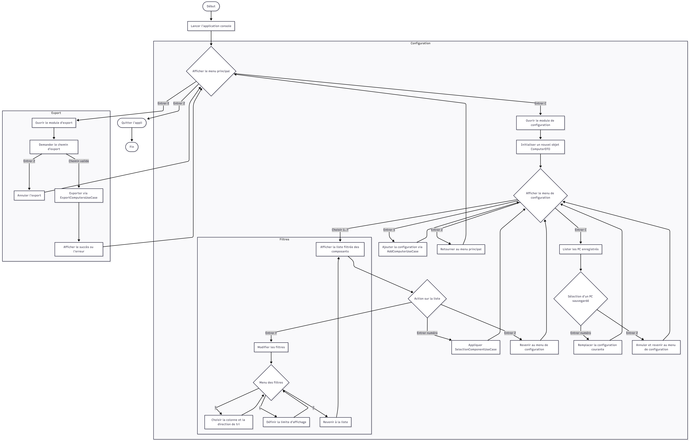
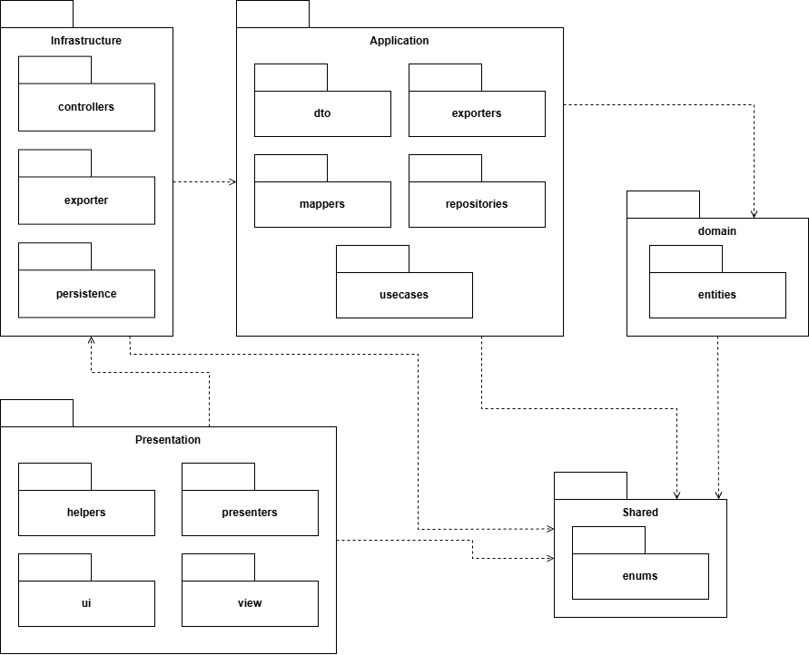
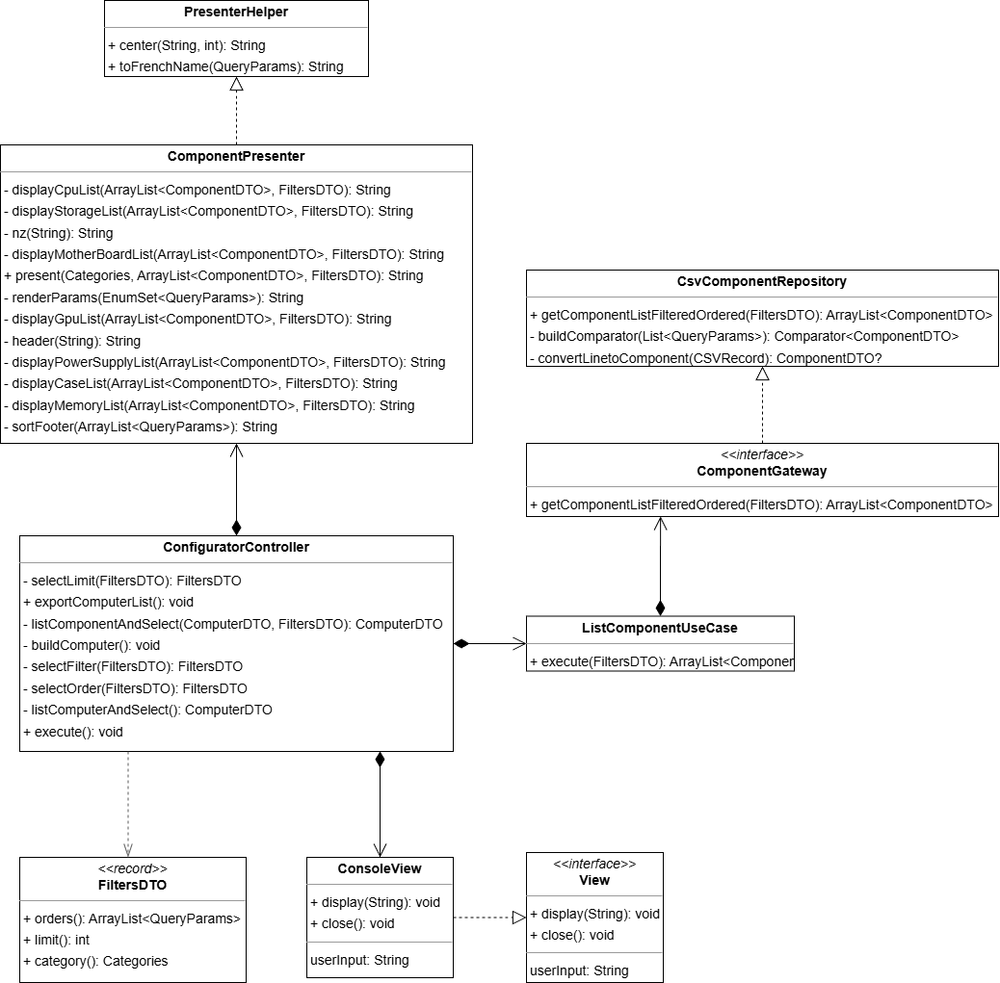
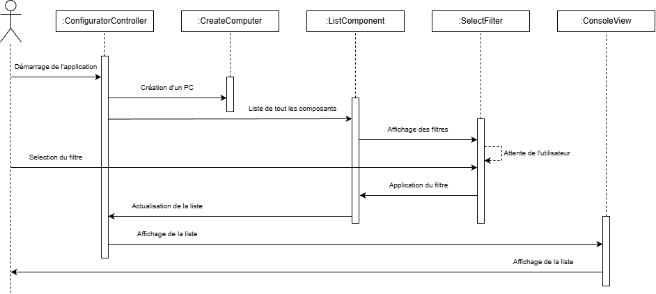

# Diagrammes du projet

> Vue d'ensemble des cas d'utilisation et des principaux diagrammes du projet PCBuilder.

## Table des matières

1. [Scénarios fonctionnels](#sc%C3%A9narios-fonctionnels)
2. [Diagrammes de cas d'utilisation](#diagrammes-de-cas-dutilisation)
3. [Diagramme d'activité](#diagramme-dactivit%C3%A9)
4. [Diagramme de packages](#diagramme-de-packages)
5. [Diagramme de classes](#diagramme-de-classes---lister-les-composants)
6. [Diagramme de séquence](#diagramme-de-s%C3%A9quence---filtrer-des-composants)

---

## Scénarios fonctionnels

Chaque scénario est présenté sous forme de fiche synthétique rappelant les éléments clés du cas d'utilisation correspondant.

### AddComputerUseCase

| Section | Description |
| :-- | :-- |
| **Titre du cas d'utilisation** | Ajouter ou mettre à jour un ordinateur |
| **Acteur principal** | Utilisateur configurant un PC |
| **Acteurs secondaires** | Passerelle `ComputerGateway` pour la persistance |
| **Brève description** | Transforme un `ComputerDTO` en entité et l'enregistre dans le dépôt en remplaçant la version précédente si nécessaire |
| **Déclencheur** | L'utilisateur valide la sauvegarde de la configuration courante |
| **Scénario principal** | <ol><li>Recevoir un `ComputerDTO`.</li><li>Convertir le DTO en entité via `ComputerMapper`.</li><li>Supprimer toute entité existante portant le même identifiant.</li><li>Ajouter la nouvelle entité au dépôt.</li></ol> |
| **Scénarios alternatifs** | Un objet `Computer` métier est fourni directement : l'entité est validée et ajoutée telle quelle. |
| **Postconditions** | Le dépôt contient la version la plus récente de l'ordinateur configuré |
| **Exceptions** | `ComputerDTO` ou `Computer` null → `IllegalArgumentException` |
| **Exigences non-fonctionnelles** | Opération atomique en mémoire pour éviter les doublons |
| **Notes et questions ouvertes** | Confirmer la gestion concurrente si plusieurs utilisateurs partagent le même dépôt |

### CreateComputerUseCase

| Section | Description |
| :-- | :-- |
| **Titre du cas d'utilisation** | Initialiser une configuration PC |
| **Acteur principal** | Utilisateur souhaitant démarrer une nouvelle configuration |
| **Acteurs secondaires** | `AddComputerUseCase` pour enregistrer la nouvelle entité |
| **Brève description** | Crée un ordinateur vide, le persiste puis retourne son DTO |
| **Déclencheur** | L'utilisateur demande la création d'une nouvelle configuration |
| **Scénario principal** | <ol><li>Instancier une nouvelle entité `Computer`.</li><li>Déléguer l'enregistrement à `AddComputerUseCase`.</li><li>Retourner la représentation `ComputerDTO` de l'entité créée.</li></ol> |
| **Scénarios alternatifs** | Aucun |
| **Postconditions** | Un nouvel ordinateur vide est stocké et disponible côté application |
| **Exceptions** | Erreur de persistance propagée par `AddComputerUseCase` |
| **Exigences non-fonctionnelles** | Création immédiate pour garantir la disponibilité du DTO initial |
| **Notes et questions ouvertes** | Définir si des valeurs par défaut doivent être ajoutées lors de la création |

### ListComponentUseCase

| Section | Description |
| :-- | :-- |
| **Titre du cas d'utilisation** | Lister les composants filtrés |
| **Acteur principal** | Utilisateur choisissant un composant pour son PC |
| **Acteurs secondaires** | `ComponentGateway` responsable de l'accès aux données |
| **Brève description** | Applique des filtres métier pour récupérer une liste de `ComponentDTO` |
| **Déclencheur** | L'utilisateur sélectionne une catégorie et des critères de tri/filtre |
| **Scénario principal** | <ol><li>Recevoir un `FiltersDTO` valide.</li><li>Vérifier que la catégorie est renseignée et que la limite est positive.</li><li>Demander au `ComponentGateway` la liste filtrée et ordonnée.</li><li>Retourner la collection de composants.</li></ol> |
| **Scénarios alternatifs** | Aucun |
| **Postconditions** | Les composants pertinents sont présentés à l'utilisateur |
| **Exceptions** | Paramètres invalides → `IllegalArgumentException`. Erreur d'accès aux données → `RuntimeException` encapsulant la cause |
| **Exigences non-fonctionnelles** | Validation des entrées pour prévenir les requêtes incohérentes |
| **Notes et questions ouvertes** | Confirmer la stratégie de pagination associée au champ `limit` |

### SelectionComponentUseCase

| Section | Description |
| :-- | :-- |
| **Titre du cas d'utilisation** | Associer un composant à la configuration |
| **Acteur principal** | Utilisateur construisant son PC |
| **Acteurs secondaires** | `ComputerGateway` pour reconstituer l'état courant |
| **Brève description** | Convertit les DTO en entités, positionne le composant dans l'ordinateur et retourne la configuration mise à jour |
| **Déclencheur** | L'utilisateur choisit un composant spécifique dans la liste |
| **Scénario principal** | <ol><li>Recevoir le `ComputerDTO` courant et le `ComponentDTO` sélectionné.</li><li>Convertir les DTO en entités métier.</li><li>Affecter le composant au slot correspondant selon sa catégorie.</li><li>Retourner le `ComputerDTO` mis à jour.</li></ol> |
| **Scénarios alternatifs** | Aucun |
| **Postconditions** | Le composant choisi est associé à la configuration utilisateur |
| **Exceptions** | Catégorie non supportée → `IllegalArgumentException` |
| **Exigences non-fonctionnelles** | Garantir la cohérence des conversions DTO ↔ entités |
| **Notes et questions ouvertes** | Gérer l'éventuelle compatibilité entre composants (non couverte aujourd'hui) |

### SelectFiltersUseCase

| Section | Description |
| :-- | :-- |
| **Titre du cas d'utilisation** | Préparer les filtres de recherche |
| **Acteur principal** | Utilisateur affinant la recherche de composants |
| **Acteurs secondaires** | Entité `UserParams` pour appliquer les règles métier |
| **Brève description** | Valide et normalise les filtres saisis ou fournit des valeurs par défaut |
| **Déclencheur** | L'utilisateur définit ou réinitialise les critères de filtrage |
| **Scénario principal** | <ol><li>Recevoir un `FiltersDTO` (ou `null`).</li><li>Retourner des valeurs par défaut si la requête est nulle.</li><li>Valider limite, catégorie et ordres.</li><li>Construire `UserParams` et en déduire un `FiltersDTO` normalisé.</li></ol> |
| **Scénarios alternatifs** | Aucun |
| **Postconditions** | Des filtres prêts à l'emploi sont fournis au reste du système |
| **Exceptions** | Limite ≤ 0, catégorie ou ordres invalides → `IllegalArgumentException` |
| **Exigences non-fonctionnelles** | Validation stricte pour éviter des combinaisons incohérentes |
| **Notes et questions ouvertes** | Étendre la logique pour inclure des filtres dépendants du budget |

### ListComputerUseCase

| Section | Description |
| :-- | :-- |
| **Titre du cas d'utilisation** | Lister les configurations enregistrées |
| **Acteur principal** | Utilisateur consultant ses PC sauvegardés |
| **Acteurs secondaires** | `ComputerGateway` pour accéder au dépôt |
| **Brève description** | Parcourt les entités persistées et fournit la liste des `ComputerDTO` |
| **Déclencheur** | L'utilisateur ouvre la bibliothèque de configurations |
| **Scénario principal** | <ol><li>Récupérer la collection d'entités `Computer`.</li><li>Mapper chaque entité en `ComputerDTO`.</li><li>Retourner la liste immuable résultante.</li></ol> |
| **Scénarios alternatifs** | Aucun |
| **Postconditions** | Les configurations sauvegardées sont disponibles pour affichage |
| **Exceptions** | Erreurs de récupération propagées par la passerelle |
| **Exigences non-fonctionnelles** | Utiliser un flux immuable pour éviter les modifications non contrôlées |
| **Notes et questions ouvertes** | Définir l'ordre d'affichage (chronologique, alphabétique, etc.) |

### ExportComputersUseCase

| Section | Description |
| :-- | :-- |
| **Titre du cas d'utilisation** | Exporter les configurations au format externe |
| **Acteur principal** | Utilisateur souhaitant sauvegarder ou partager ses PC |
| **Acteurs secondaires** | `ComputerExporter` (format JSON) et `ComputerGateway` |
| **Brève description** | Transmet la liste des ordinateurs au module d'export vers un fichier |
| **Déclencheur** | L'utilisateur choisit d'exporter ses configurations |
| **Scénario principal** | <ol><li>Recevoir l'implémentation de `ComputerExporter` et le chemin cible.</li><li>Obtenir la collection de configurations depuis le dépôt.</li><li>Déléguer l'écriture des données à l'exporteur.</li></ol> |
| **Scénarios alternatifs** | Aucun |
| **Postconditions** | Un fichier externe contient la liste des ordinateurs sauvegardés |
| **Exceptions** | Erreurs d'écriture gérées par l'exporteur |
| **Exigences non-fonctionnelles** | La responsabilité d'I/O est externalisée pour faciliter le changement de format |
| **Notes et questions ouvertes** | Prévoir un retour utilisateur sur le succès ou l'échec de l'export |

---

## Diagrammes de cas d'utilisation

### De haut niveau — Projet

### Détaillé — Sélectionner un composant

---

## Diagramme d'activité

---

## Diagramme de packages

---

## Diagramme de classes - Lister les composants

---

## Diagramme de séquence - Filtrer des composants

